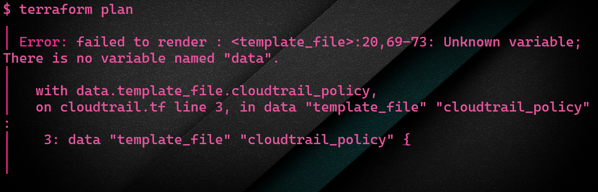

# AWS CloudTrail with Terraform

## Terraform Failed to Render Error

```bash
│ Error: failed to render : <template_file>:20,69-73: Unknown variable; There is no variable named "data".
│
│   with data.template_file.cloudtrail_policy,
│   on cloudtrail.tf line 3, in data "template_file" "cloudtrail_policy":
│    3: data "template_file" "cloudtrail_policy" {
```

- The `template` argument in the `template_file` data source is processed as Terraform template syntax.

- In this syntax, using `${...}` has a special meaning, that the `...` part will be injected by some var that is passed into the template.

- Bash also allows this syntax, for getting the values of variables as your intending to use it.

- To reconcile this, you'll need to escape the `$` character so that the terraform template compiler will leave it be, which you can do by doubling up the character: `$${i}` in all cases.

## Terraform Error



## Eval Command

If you use `$$` then the shell can only be run in Terraform environment. I recommend to use following command to run the shell in Terraform environment which keeps shell as shell and works with terraform. I am wondering if there is an option to tell terraform not to interpret shell script.

```bash
eval "$"{i}
```

## References

[Why does Terraform fail to render?](https://stackoverflow.com/questions/60203230/why-does-terraform-aws-code-fail-to-render)

[String Literals and String Templates](https://www.terraform.io/configuration/expressions#string-templates)

[Strings and Templates](https://www.terraform.io/language/expressions/strings)
